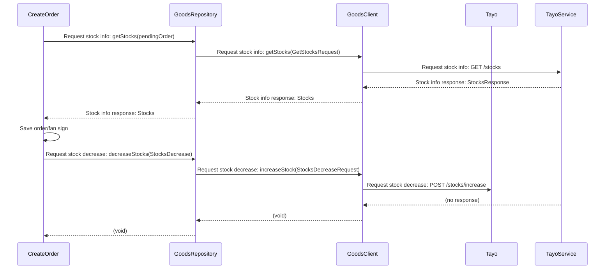
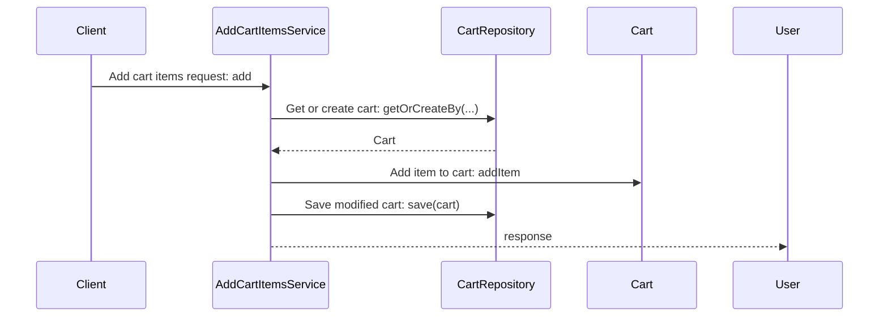

# PR Review Purpose

- To identify code defects that may pose a risk of causing bugs before deployment.

# PR Review Format

1. Summary of major changes
2. Sequence diagram(can be omitted)
3. Code comments or suggestions(can be omitted)

# PR Review Rules

## Basic Rules

- Describe changes focusing on important content concisely.
- Use the term "refactoring" only when there are no functional changes, and be careful not to overuse it.

# Sequence Diagram Creation Rules

- Sequence diagrams should be created to make the logic flow easy to understand.
- Create sequence diagrams when there are interactions between multiple services/components or complex business flows.
- Can be omitted for simple CRUD operations or refactoring.

# Code Review Rules

- Code comments and suggestions should focus on code that is likely to cause bugs.
- If there appears to be no bug possibility or security vulnerability, do not provide code comments or suggestions.
- Always point out when @Transactional annotation is missing for functions that modify DB data.
- Always point out code that may cause NPE (NullPointerException).
- Always point out code that may cause NumberFormatException.
- Maintain immutability whenever possible. Avoid variable reassignment or object state changes as much as possible.
  Actively use the final keyword.
- When business logic changes, verify that the corresponding test code has been modified.
- Point out when tests for boundary values or exceptional situations are insufficient.
- Suggest encapsulation when test code includes information unrelated to the verification target.
- Concurrency issues: Review code that may cause problems in multi-threaded environments.
    - Verify synchronization handling for shared resources
    - Point out use of non-thread-safe collections
- Do not make unnecessary comments such as praise or positive feedback about the code. Just focus on identifying
  potential issues. If you don't find any issues, omit the code comment section.

## Security Review Items

- SQL Injection vulnerabilities (whether parameter binding is used)
- Logging of sensitive information (passwords, personal information, etc.)
- Vulnerabilities due to lack of input validation

# PR Review Examples

## Major Changes Description Examples

- Modifying category-related fields in the `OrderLineItem` class to fix errors in coupon application criteria.
- Adding postal code validation functionality, implementing validation of postal code formats by country when creating
  delivery addresses.
- Refactoring to use `@AuthenticationPrincipal` annotation instead of `UserLoader` to retrieve currently logged-in user
  information.

## Sequence Diagram Examples





## Code Comment or Suggestion Examples

- Code that is likely to cause NPE
    - Problem Code:
      ```java
        @Getter
        @ToString
        @EqualsAndHashCode
        @Accessors(fluent = true)
        public final class GoodsCategory {
        private final String categoryName;
        private final List<Long> categoryPath;
        private final String artistCategoryName;
        private final List<Long> artistCategoryPath;
        private final String brandCategoryName;
        private final List<Long> brandCategoryPath;

            public GoodsCategory(
                    final String categoryName,
                    final List<Long> categoryPath,
                    final String artistCategoryName,
                    final List<Long> artistCategoryPath,
                    final String brandCategoryName,
                    final List<Long> brandCategoryPath
            ) {
                this.categoryName = categoryName;
                this.categoryPath = categoryPath;
                this.artistCategoryName = artistCategoryName;
                this.artistCategoryPath = artistCategoryPath;
                this.brandCategoryName = brandCategoryName;
                this.brandCategoryPath = brandCategoryPath;
            }

            boolean contains(final Long categoryNo) {
                return categoryPath.contains(categoryNo) ||
                       artistCategoryPath.contains(categoryNo) ||
                       brandCategoryPath.contains(categoryNo);
            }
        }
      ```
        - Review comment: NPE may occur in `GoodsCategory::contains` method if GoodsCategory field values are null. You
          can prevent NPE by
          setting default values for fields in the constructor.
      ```java
          public GoodsCategory(
              final String categoryName,
              final List<Long> categoryPath,
              final String artistCategoryName,
              final List<Long> artistCategoryPath,
              final String brandCategoryName,
              final List<Long> brandCategoryPath
      ) {
          this.categoryName = Objects.requireNonNullElse(categoryName, "");
          this.categoryPath = Objects.requireNonNullElse(categoryPath, List.of());
          this.artistCategoryName = Objects.requireNonNullElse(artistCategoryName, "");
          this.artistCategoryPath = Objects.requireNonNullElse(artistCategoryPath, List.of());
          this.brandCategoryName = Objects.requireNonNullElse(brandCategoryName, "");
          this.brandCategoryPath = Objects.requireNonNullElse(brandCategoryPath, List.of());
      }
      ```
- Code that risks breaking transactions
    - Problem code:
      ```java
      @RequiredArgsConstructor
      @Service
      class CreateOrder {
          private final CartRepository cartRepository;

          public void createOrder(final PendingOrder pendingOrder) {
              final Cart cart = cartRepository.getCart();

              cart.update();
              pendingOrder.update();

              orderRepository.save(pendingOrder);
              cartRepository.save(cart);
          }
      }
      ```
        - Review comment: `CreateOrder` modifies DB data but lacks `@Transactional` annotation. Add `@Transactional`
          annotation for transaction handling.
- Breaking immutability
    - Problem code:
    ```java
    public class Coupons {
    private List<Coupon> coupons;

        public List<Coupon> listUsable() {
            for (final Coupon coupon : coupons) {
                if (!coupon.isUsable()) {
                    coupons.remove(coupon);
                }
            }
            return coupons;
        }

    }
    ```
    - Review comment: The `coupons` List is modified directly, which breaks immutability. Instead, you can create a new
      List containing only usable coupons without modifying the original List.
    ```java
      public List<Coupon> listUsable() {
          return coupons.stream()
                  .filter(Coupon::isUsable)
                  .toList();
      }
    ```

- SQL Injection vulnerability
    - Problem code:
  ```java
      public List<Order> findOrdersByStatus(final String status) {
          final String query = "SELECT * FROM orders WHERE status = '" + status + "'";
          return jdbcTemplate.query(query, orderRowMapper);
      }
  ```

    - Review comment: There is an SQL Injection vulnerability. Parameter binding should be used.

- Sensitive information logging
    - Problem code:
        ```java
        @PostMapping("/users/login")
        public ResponseEntity<LoginResponse> login(@RequestBody final LoginRequest request) {
            log.info("Login attempt - email: {}, password: {}",
            request.getEmail(), request.getPassword());
            // ...
        }
      ```
    - Review comment: Logging sensitive information like passwords poses a security risk. Sensitive information should
      be excluded from logging.

- Missing boundary value tests
    - Problem code:
      ```java
      @Test
      void coupon_discount_application_test() {
          final int originalPrice = 10000;
          final int discountRate = 10;

          final int discountedPrice = couponService.applyDiscount(originalPrice, discountRate);

          assertThat(discountedPrice).isEqualTo(9000);
      }
      ```
    - Review comment: Tests for boundary values (0%, 100% discount) or exceptional situations (negative prices, discount
      rates exceeding 100%) are missing. The following test cases should be added:
        - 0% discount application
        - 100% discount application
        - Exception handling for negative price input
        - Exception handling for discount rate exceeding 100%

- Naming that causes cognitive errors
    - Problem code:
      ```java
         final Mileage requestedMileage = mileageRepository.getRequestedMileage(principal, KoreanWon.from(mileage));
      ```
        - Review comment: The variable name `requestedMileage` can be misleading as it suggests mileage requested by the
          user. Since this is mileage retrieved from the repository, I recommend simply using `mileage`.

    - Problem code:
      ```java
      public boolean isSoldOut() {
          return status != SOLD_OUT;
      }
      ```
        - Review comment: The `isSoldOut` method returns `true` when stock is available, which conflicts with the method
          name and logic. I recommend changing it to a name like `isAvailable` or `isInStock`.
  - Problem code:
    ```java
        @Test
        @DisplayName("상점의 마일리지 사용 제한 금액이 적립 마일리지보다 크면 사용 가능 마일리지는 구매 금액과 같다")
        void testAvailableMileageWithStoreLimit() {
        mock(aPendingOrder()
              .withTotalPurchasePrice(30_000)
              .withMileage(aMileage()
                  .maxLimit(20_000)
                  .transactions(
                      aTransaction()
                          .earned(1_000_000)
                          .used(0))));

              final GetMileage.Response result = execute();

              assertThat(result.total()).isEqualTo(1_000_000);
              assertThat(result.available()).isEqualTo(20_000);
        }
    ```
      - Review comment: The display name suggests that the available mileage should be equal to the purchase amount
        when
        the store's mileage usage limit is greater than the earned mileage. However, the test logic indicates that the
        available mileage is limited to the store's limit. I recommend changing the test name to clarify that it
        checks
        if the available mileage does not exceed the store's limit, such as "상점의 최대 마일리지 사용 제한 금액이 적립 마일리지보다 작으면 사용 가능
        마일리지는 최대 마일리지 사용 제한 금액과 같다"
