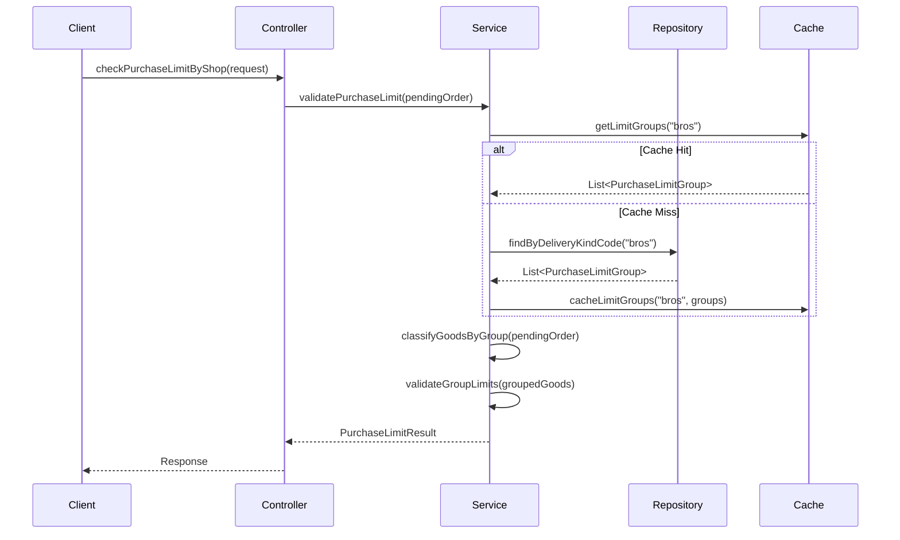
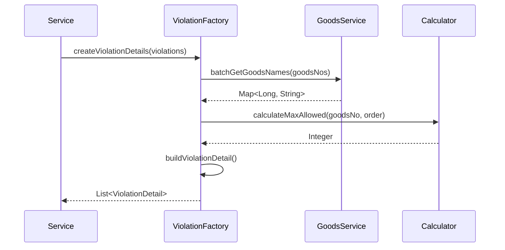
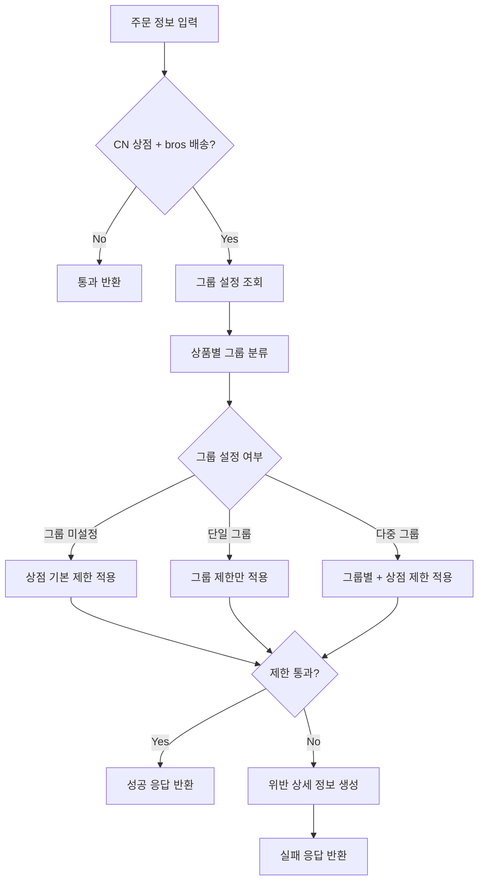

# FO-1282: CN 상점 구매 제한 기능 개선 SRS

## 📋 1. 서론 (Introduction)

### 1.1 목적 (Purpose)
본 문서는 CN 상점 구매 제한 기능 개선 프로젝트의 소프트웨어 요구사항을 상세히 명세합니다. 
개발팀이 PRD에서 정의된 비즈니스 요구사항을 구체적인 소프트웨어 구현으로 전환할 수 있도록 기술적 요구사항, 인터페이스 명세, 시스템 설계를 제공합니다.

### 1.2 범위 (Scope)
- **핵심 기능**: CheckPurchaseLimitByShop GraphQL API 확장
- **적용 범위**: CN 상점(197) + 중국 배송지 + bros(yto) 배송방법
- **주요 개선사항**: 상품 그룹별 제한 + 상세 실패 정보 제공

### 1.3 정의 및 약어 (Definitions and Acronyms)
- **SRS**: Software Requirements Specification
- **PRD**: Product Requirements Document  
- **CN Shop**: 중국 상점 (shopNo: 197)
- **Bros**: 해외직구 및 국내외 화물운송, 통관, 포워딩 전문 한국 회사
- **YTO**: 중국 최대 규모의 물류 서비스
- **Purchase Limit**: 구매 제한 수량
- **Violation Detail**: 제한 위반 상세 정보

### 1.4 참조문서 (References)
- FO_1282_PRD.md: 제품 요구사항 문서
- cn_shop_purchase_limit_domain_rule_to_be.md: 도메인 룰 명세
- CheckPurchaseLimitByShop.java: 기존 구현체

## 🎯 2. 전체 설명 (Overall Description)

### 2.1 제품 관점 (Product Perspective)
현재 시스템은 하드코딩된 단일 구매 제한(10개)만을 지원합니다. 본 프로젝트는 이를 확장하여:
- 동적 설정 가능한 상품 그룹별 제한 시스템 구축
- 사용자에게 구체적인 실패 정보 제공
- 기존 API 호환성 유지하면서 기능 확장

### 2.2 제품 기능 (Product Functions)
- **F-1**: 상품 그룹별 제한 수량 관리
- **F-2**: 복합 제한 규칙 검증 (상점 제한 + 그룹 제한)
- **F-3**: 상세 실패 정보 생성 및 제공
- **F-4**: 구매 가능 수량 계산
- **F-5**: 상품명 조회 및 사용자 친화적 메시지 생성

### 2.3 사용자 특성 (User Classes and Characteristics)
- **구매자**: 중국 상점에서 상품 구매하는 일반 사용자
- **CS 담당자**: 구매 제한 관련 고객 문의 처리
- **운영자**: 상품 그룹 및 제한 수량 설정 관리

### 2.4 제약사항 (Constraints)
- **기술적 제약**: 기존 CheckPurchaseLimitByShop API 인터페이스 유지
- **호환성 제약**: 기존 테스트 케이스 통과 보장
- **데이터 제약**: MySQL 8.0 데이터베이스 사용

## 🔧 3. 구체적 요구사항 (Specific Requirements)

### 3.1 기능적 요구사항 (Functional Requirements)

#### FR-001: 상품 그룹 설정 조회 기능
**설명**: 배송 방법에 따른 상품 그룹별 제한 설정을 조회합니다.

**입력**: 
- deliveryKindCode: String (배송 방법 코드)

**처리**:
1. ORDER_QTY_LIMIT 테이블에서 해당 배송 방법의 활성 그룹 조회
2. ORDER_QTY_LIMIT_GOODS 테이블에서 각 그룹별 상품 매핑 조회

**출력**:
- List<PurchaseLimitGroup>: 그룹별 제한 설정 목록

**예외 처리**:
- 배송 방법 코드가 null인 경우 빈 목록 반환

#### FR-002: 복합 제한 규칙 검증 기능
**설명**: 상점 기본 제한과 그룹별 제한을 조합하여 주문의 유효성을 검증합니다.

**입력**:
- pendingOrder: PendingOrder (주문 정보)
- limitGroups: List<PurchaseLimitGroup> (그룹 설정)

**처리**:
1. 주문 상품들을 그룹별로 분류
2. 각 그룹별 수량 합계 계산 (QTY × GOODS_PACK_CNT)
3. 제한 적용 로직:
   - 그룹 미설정 상품: 상점 기본 제한(10개) 적용
   - 단일 그룹: 해당 그룹 제한만 적용
   - 다중 그룹: 각 그룹 제한 + 상점 전체 제한 모두 적용

**출력**:
- PurchaseLimitResult: 검증 결과 및 위반 정보

**예외 처리**:
- GOODS_PACK_CNT가 null인 경우 1로 처리
- 그룹 설정이 삭제된 상품은 상점 기본 제한 적용

#### FR-003: 상세 실패 정보 생성 기능
**설명**: 제한 위반 시 사용자에게 제공할 구체적인 실패 정보를 생성합니다.

**입력**:
- violations: List<GroupLimitViolation> (위반 정보)
- pendingOrder: PendingOrder (주문 정보)

**처리**:
1. 위반된 각 상품의 상세 정보 수집
2. 상품명 조회 (Goods 도메인 연동)
3. 최대 구매 가능 수량 계산
4. ViolationDetail 객체 생성

**출력**:
- List<ViolationDetail>: 위반 상품별 상세 정보

**예외 처리**:
- 상품명 조회 실패 시 상품 번호만 제공
- 상품명 조회 타임아웃 시 기본 메시지 사용

#### FR-004: 구매 가능 수량 계산 기능
**설명**: 현재 주문에서 각 상품의 최대 구매 가능 수량을 계산합니다.

**입력**:
- goodsNo: Long (상품 번호)
- currentOrder: PendingOrder (현재 주문)
- limitGroups: List<PurchaseLimitGroup> (그룹 설정)

**처리**:
1. 해당 상품이 속한 그룹 식별
2. 그룹 내 다른 상품들의 주문 수량 합계 계산
3. 그룹 제한에서 현재 사용된 수량을 차감하여 가용 수량 계산
4. 상점 전체 제한도 고려하여 최종 가용 수량 결정

**출력**:
- Integer: 해당 상품의 최대 구매 가능 수량

### 3.2 비기능적 요구사항 (Non-functional Requirements)

#### NFR-001: 성능 요구사항
- **응답 시간**: API 응답 시간 95% 이하에서 500ms 이내
- **처리량**: 초당 100개 이상의 동시 요청 처리 가능
- **메모리 사용량**: 힙 메모리 사용량 증가 < 50MB

#### NFR-002: 가용성 요구사항  
- **시스템 가용성**: 99.9% 이상 유지
- **데이터베이스 연결**: Connection pool을 통한 안정적 연결 관리
- **장애 복구**: 서비스 재시작 시 30초 이내 정상 서비스 재개

#### NFR-003: 확장성 요구사항
- **그룹 확장**: 최대 100개 그룹까지 선형 성능 보장
- **상품 확장**: 그룹당 최대 1,000개 상품까지 지원
- **캐시 확장**: Redis 클러스터를 통한 수평 확장 지원

#### NFR-004: 호환성 요구사항
- **API 호환성**: 기존 GraphQL 스키마 하위 호환성 유지
- **데이터 호환성**: 기존 테이블 구조 영향 최소화
- **클라이언트 호환성**: 기존 프론트엔드 코드 수정 불필요

### 3.3 인터페이스 요구사항 (Interface Requirements)

#### IR-001: GraphQL API 인터페이스
```graphql
type Query {
  checkPurchaseLimitByShop(
    cartId: UUID!
    addressId: Long!
    volumeWeightId: String!
    shippingMethodId: String!
  ): CheckPurchaseLimitResponse!
}

type CheckPurchaseLimitResponse {
  isPass: Boolean!
  limitQuantity: Int!
  limitType: String!
  message: String
  groupLimits: [GroupLimitInfo!]!
  violations: [ViolationDetail!]!
}

type GroupLimitInfo {
  groupNo: Long!
  groupName: String!
  currentQuantity: Int!
  limitQuantity: Int!
}

type ViolationDetail {
  goodsNo: Long!
  goodsName: String
  currentQuantity: Int!
  maxAllowedQuantity: Int!
  violationType: String!
  groupNo: Long
  groupName: String
}
```

#### IR-002: 데이터베이스 인터페이스
```sql
-- 그룹별 제한 마스터 테이블
CREATE TABLE ORDER_QTY_LIMIT (
    QL_NO BIGINT PRIMARY KEY AUTO_INCREMENT,
    DELIVERY_KIND_CD VARCHAR(20) NOT NULL,
    QL_NM VARCHAR(100) NOT NULL,
    LIMIT_QTY INT NOT NULL,
    CMMT TEXT,
    DEL_YN CHAR(1) DEFAULT 'N',
    REG_USER_NO BIGINT NOT NULL,
    REG_DT DATETIME DEFAULT CURRENT_TIMESTAMP,
    MOD_USER_NO BIGINT,
    MOD_DT DATETIME DEFAULT CURRENT_TIMESTAMP ON UPDATE CURRENT_TIMESTAMP,
    INDEX idx_delivery_del (DELIVERY_KIND_CD, DEL_YN)
);

-- 그룹별 상품 매핑 테이블
CREATE TABLE ORDER_QTY_LIMIT_GOODS (
    QL_NO BIGINT NOT NULL,
    GOODS_NO BIGINT NOT NULL,
    DEL_YN CHAR(1) DEFAULT 'N',
    REG_USER_NO BIGINT NOT NULL,
    REG_DT DATETIME DEFAULT CURRENT_TIMESTAMP,
    MOD_USER_NO BIGINT,
    MOD_DT DATETIME DEFAULT CURRENT_TIMESTAMP ON UPDATE CURRENT_TIMESTAMP,
    PRIMARY KEY (QL_NO, GOODS_NO),
    FOREIGN KEY (QL_NO) REFERENCES ORDER_QTY_LIMIT(QL_NO),
    INDEX idx_goods_del (GOODS_NO, DEL_YN)
);
```
## 🏗️ 4. 시스템 모델 (System Models)

### 4.1 시나리오 기반 모델

#### 시나리오 1: 단일 그룹 제한 검증


#### 시나리오 2: 제한 위반 시 상세 정보 생성


### 4.2 클래스 기반 모델

#### 핵심 도메인 클래스
```java
// 구매 제한 그룹
public class PurchaseLimitGroup {
    private final Long groupNo;
    private final String deliveryKindCode;
    private final String groupName;
    private final Integer limitQuantity;
    private final List<Long> goodsNumbers;
    
    public boolean containsGoods(Long goodsNo) { ... }
    public int calculateCurrentQuantity(PendingOrder order) { ... }
}

// 제한 검증 결과
public class PurchaseLimitResult {
    private final boolean isValid;
    private final LimitType limitType;
    private final Integer appliedLimit;
    private final List<ViolationDetail> violations;
    private final List<GroupLimitInfo> groupLimits;
}

// 위반 상세 정보
public class ViolationDetail {
    private final Long goodsNo;
    private final String goodsName;
    private final Integer currentQuantity;
    private final Integer maxAllowedQuantity;
    private final ViolationType violationType;
    private final Long groupNo;
    private final String groupName;
}
```

### 4.3 흐름 기반 모델

#### 제한 검증 흐름도


## ✅ 5. 검증 및 확인 (Verification & Validation)

### 5.3 테스트 케이스

#### TC-001: 단일 그룹 제한 검증
```java
@DisplayName("단일 그룹 상품 주문 시 그룹 제한만 적용된다")
@Test
void single_group_order_applies_group_limit_only() {
    // Given
    val group1 = createLimitGroup(1L, "그룹1", 5);
    val order = createPendingOrder(
        lineItem(GOODS_A, 3, group1),
        lineItem(GOODS_B, 2, group1)
    );
    
    // When
    val result = purchaseLimitService.validate(order, List.of(group1));
    
    // Then
    assertThat(result.isValid()).isTrue();
    assertThat(result.getLimitType()).isEqualTo(LimitType.GROUP_LIMIT);
    assertThat(result.getAppliedLimit()).isEqualTo(5);
}
```

#### TC-002: 제한 위반 시 상세 정보 반환
```java
@DisplayName("그룹 제한 초과 시 상세 위반 정보가 반환된다")
@Test
void group_limit_exceeded_returns_violation_details() {
    // Given
    val group1 = createLimitGroup(1L, "그룹1", 5);
    val order = createPendingOrder(
        lineItem(GOODS_A, 7, group1) // 제한 초과
    );
    
    // When
    val result = purchaseLimitService.validate(order, List.of(group1));
    
    // Then
    assertThat(result.isValid()).isFalse();
    assertThat(result.getViolations()).hasSize(1);
    
    val violation = result.getViolations().get(0);
    assertThat(violation.getGoodsNo()).isEqualTo(GOODS_A);
    assertThat(violation.getCurrentQuantity()).isEqualTo(7);
    assertThat(violation.getMaxAllowedQuantity()).isEqualTo(5);
    assertThat(violation.getViolationType()).isEqualTo(ViolationType.GROUP_LIMIT);
}
```

#### TC-003: 상품명 조회 실패 처리
```java
@DisplayName("상품명 조회 실패 시 상품번호만 반환된다")
@Test
void goods_name_fetch_failure_returns_goods_number_only() {
    // Given
    when(goodsService.batchGetGoodsNames(any()))
        .thenThrow(new ServiceException("상품명 조회 실패"));
    
    val violations = List.of(createViolation(GOODS_A));
    
    // When
    val details = violationDetailFactory.create(violations);
    
    // Then
    assertThat(details).hasSize(1);
    assertThat(details.get(0).getGoodsName()).isNull();
    assertThat(details.get(0).getGoodsNo()).isEqualTo(GOODS_A);
}
```
